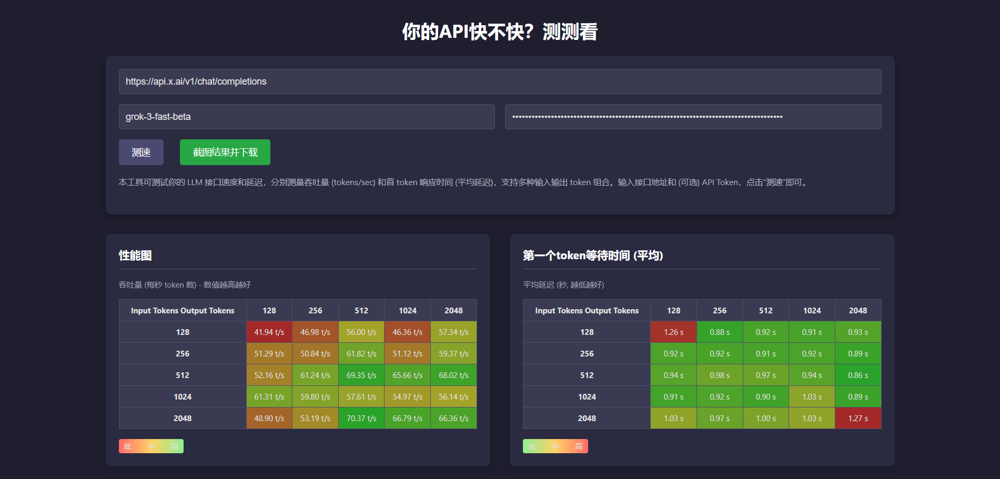

# LLM API 速度与延迟测试工具 (Cloudflare Worker)

[English version](readme_en.md)

这是一个部署在 Cloudflare Worker 上的小工具，用于测试大语言模型 (LLM) API 的调用速度和性能。它可以测量不同输入和输出 Token 组合下的吞吐量 (tokens/sec) 和首个 Token 的平均响应延迟。



## ✨ 功能特性

*   **API 端点自定义**: 支持测试任意兼容 OpenAI 流式接口的 LLM API 端点。
*   **模型名称指定**: 可以输入要测试的具体模型名称。
*   **API Token (可选)**: 支持需要身份验证的 API。
*   **性能矩阵**:
    *   **吞吐量 (Tokens/sec)**: 以表格形式展示不同输入 Token 数和输出 Token 数组合下的吞吐量，数值越高越好。
    *   **首个 Token 平均等待时间 (秒)**: 展示相应组合下的 p99 延迟，数值越低越好。
*   **动态颜色高亮**: 测试结果会根据性能好坏进行颜色编码，方便快速识别瓶颈。
*   **纯前端逻辑**: 所有测试均在用户的浏览器端发起，Cloudflare Worker 仅用于托管该单页面应用。
*   **易于部署**: 可以通过 Cloudflare Worker 的在线编辑器直接部署，或使用 Wrangler CLI。

## 🚀 如何使用

该工具设计为单 `worker.js` 文件部署，将所有 HTML, CSS, 和 JavaScript 嵌入其中。

**方法一：通过 Cloudflare 网页端部署 (最简单)**

1.  登录到你的 [Cloudflare Dashboard](https://dash.cloudflare.com/)。
2.  导航到 "Workers & Pages"。
3.  点击 "Create application" -> "Create Worker"。
4.  为你的 Worker 指定一个名称 (例如 `llm-api-speed-tester`) 和一个子域名。
5.  部署初始的 Worker。
6.  点击新创建的 Worker 名称进入详情，然后点击 "Quick edit"。
7.  删除编辑器中所有现有代码。
8.  将本项目中的 `worker.js` 文件的**全部内容**复制并粘贴到 Cloudflare 在线编辑器中。
9.  点击 "Save and deploy"。
10. 访问你 Worker 的 URL (例如 `https://llm-api-speed-tester.your-username.workers.dev`) 即可开始使用。

**方法二：使用 Wrangler CLI 部署 (适用于本地开发和版本控制)**

1.  **安装 Wrangler CLI**: 如果你还没有安装，请参考 [Cloudflare Wrangler官方文档](https://developers.cloudflare.com/workers/wrangler/get-started/)。
    ```bash
    npm install -g wrangler
    ```
2.  **登录 Wrangler**:
    ```bash
    wrangler login
    ```
3.  **克隆或下载本仓库** (如果你已经上传到 GitHub)。
4.  **创建 `wrangler.toml` 文件**:
    在项目根目录下创建一个 `wrangler.toml` 文件，内容如下：
    ```toml
    name = "llm-api-speed-tester" # 你可以自定义 Worker 名称
    main = "worker.js"           # 指向包含所有代码的 JS 文件
    compatibility_date = "2023-12-01" # 使用一个有效的兼容性日期
    # 如果你的 worker.js 文件名不同，请相应修改 main 的值
    ```
5.  **部署 Worker**:
    在项目根目录下运行：
    ```bash
    wrangler deploy
    ```
6.  Wrangler 会输出部署后的 URL。

**开始测试：**

1.  打开部署好的 Worker URL。
2.  输入目标 LLM API 的完整 Endpoint 地址 (例如 `https://api.openai.com/v1/chat/completions`)。
3.  输入模型名称 (例如 `gpt-3.5-turbo`)。
4.  如果 API 需要，输入你的 API Token。
5.  点击 "测速" 按钮，等待测试结果在表格中显示。

## 🛠️ 技术细节

*   **前端**: HTML, CSS, 和纯 JavaScript。
*   **后端**: Cloudflare Worker (仅用于服务单页面应用)。
*   **API 调用**: 使用浏览器 `fetch` API 以流式 (stream) 方式调用 LLM API。
*   **性能指标**:
    *   **首个 Token 延迟**: 从发送请求到接收到第一个数据块的时间。为降低波动，会对每个单元格进行多次测试并取平均值。
    *   **吞吐量**: (近似输出 Token 数) / (总响应时间)。输出 Token 数通过计算接收到的字符数并除以一个平均值（例如 4 字符/Token）来近似。
*   **Token 近似**: 由于前端无法直接访问特定模型的 Tokenizer，输入 Token 数是通过生成特定长度的占位符文本来模拟的，输出 Token 数是基于实际接收到的字符数进行估算的。

## 📝 注意事项与限制

*   **Token 近似精度**: Token 计数是近似值，实际的 Token 数可能因模型和文本内容而异。
*   **网络波动**: 测试结果受用户当前网络环境影响。建议多次测试或在不同网络下测试以获得更全面的了解。
*   **浏览器限制**: 大量并发请求或长时间测试可能受浏览器资源限制。
*   **API 速率限制**: 请注意不要超过目标 LLM API 的速率限制，否则可能导致测试失败或账户问题。
*   **CORS**: 工具直接从浏览器向目标 API 发起请求。如果目标 API 没有正确配置 CORS (Cross-Origin Resource Sharing) 策略以允许来自你的 Worker 域名的请求，测试将无法进行。大多数公共 LLM API 已经配置了较为宽松的 CORS 策略。
*   **Worker 脚本大小**: 由于所有代码嵌入在一个 JS 文件中，请注意不要超过 Cloudflare Worker 的脚本大小限制（免费版通常为 1MB 压缩后）。

## 💡 未来可能的改进

*   [ ] 支持导入/导出测试配置和结果。
*   [ ] 更精确的 Token 计算（如果可能集成轻量级 Tokenizer）。
*   [ ] "分享结果" 功能的后端实现。
*   [ ] 可视化图表展示历史测试数据。

## 🤝 贡献

欢迎提出问题 (Issues) 或提交合并请求 (Pull Requests)！

## 📄 开源许可

本项目采用 [MIT License](LICENSE) 开源。
